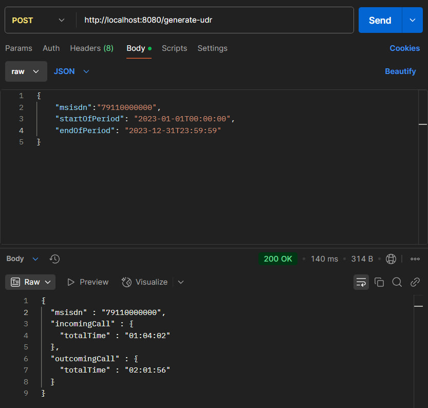
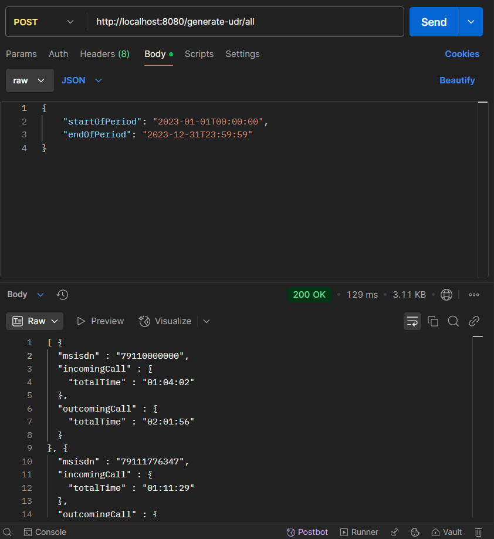
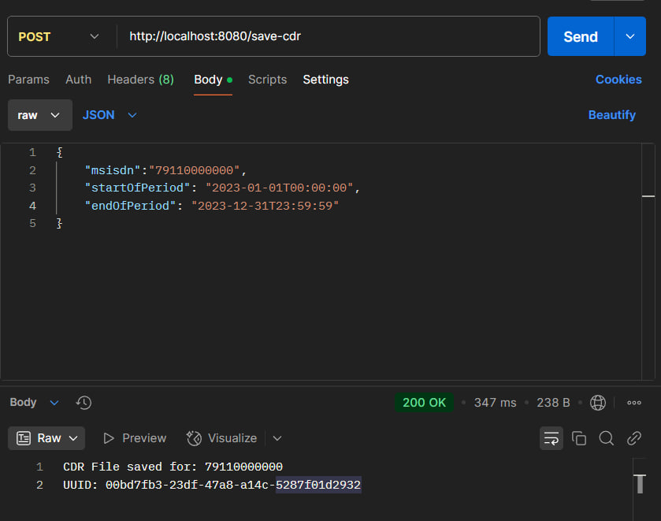

# Nexign Task

---
## Оглавление

- [Описание задания](#описание-задания)
    - [Дано](#дано)
    - [Постановка задачи](#постановка-задачи)
- [Необходимая информация](#необходимая-информация)
    - [CDR-запись](#cdr-запись)
    - [UDR-отчет](#udr-отчет)
- [Логика работы микросервиса](#логика-работы-микросервиса)
    - [Начало работы](#начало-работы)
    - [Генерация CDR-записей](#генерация-cdr-записей)
    - [Работа контроллеров](#работа-контроллеров)
        - [Эндпоинт `/generate-udr`](#эндпоинт-generate-udr)
        - [Эндпоинт `/generate-udr/all`](#эндпоинт-generate-udrall)
        - [Эндпоинт `/save-cdr`](#эндпоинт-save-cdr)
- [Полезные ссылки и примеры запросов](#полезные-ссылки-и-примеры-запросов)
    - [База данных](#база-данных)
    - [Примеры запросов и ответов](#примеры-запросов-и-ответов-для-каждого-эндпоинта)
- [Скриншоты из Postman](#скриншоты-из-postman)
    - [Эндпоинт `/generate-udr`](#эндпоинт-generate-udr-1)
    - [Эндпоинт `/generate-udr/all`](#эндпоинт-generate-udrall-1)
    - [Эндпоинт `/save-cdr`](#эндпоинт-save-cdr-1)
- [Запуск сервиса](#запуск-сервиса)
- [Итог](#итог)

---
## Описание задания

### Дано
Абонент находится в роуминге, и за процесс сбора его данных отвечает обслуживающая сеть абонента.
Данные, согласно стандарту BCE, фиксируются в формате CDR (Call Data Record) и агрегируются в единый
UDR (Usage Data Report) отчет, который впоследствии передается оператору, обслуживающему абонента
в домашней сети.

### Постановка задачи
Необходимо разработать микросервис, который будет имитировать работу сотового оператора, генерировать
CDR-записи, сохранять их в базу данных и предоставлять отчет по одному или всем абонентам по запросу.

---

## Необходимая информация

### CDR-запись включает следующие данные:
- Тип вызова (`01` — исходящий, `02` — входящий).
- Номер абонента, инициирующего звонок.
- Номер абонента, принимающего звонок.
- Дата и время начала звонка (в формате ISO 8601).
- Дата и время окончания звонка (в формате ISO 8601).

### UDR-отчет включает следующие данные:
- Номер абонента.
- Суммарное время исходящих звонков.
- Суммарное время входящих звонков.

---

## Логика работы микросервиса

### Начало работы
1. Главный класс `CdrServiceApplication` запускает приложение.
2. Spring Boot проверяет классы на наличие аннотаций (`@RestController`, `@Service`, `@Repository`, `@Component`) и регистрирует их как бины.
3. Spring Boot запускает встроенный сервер.
4. Метод `init()` сервиса `CDRService`, помеченный аннотацией `@Scheduled`, начинает выполняться через 1 секунду после старта приложения.
5. Приложение готово к обработке HTTP-запросов через контроллеры `SaveCDR` и `GenerateUDR`.

---

### Генерация CDR-записей

1. Метод `init()` сервиса `CDRService` вызывает метод `makeCustomers()` класса `CustomersGenerator`, которому передается желаемое количество абонентов. Внутри этого метода создается массив, который с помощью утилиты `generatePhoneNumber()` заполняется телефонными номерами и сохраняется в таблицу H2 под названием `CUSTOMERS`.
2. Запускается daemon-поток, в котором создаются CDR-записи для пользователей. Вызывается метод `makeCDRRecords()` класса `CallsGenerator`, которому передается список пользователей.
   Решил использовать отдельный daemon-поток, так как генерация звонков на год должна идти фоновым процессом.
Чтобы не было безконтрольного создания записей, они создаются разом на год каждые 60 секунд. На это время
daemon-поток засыпает, в то время как Main Thread остается активным и готов принимать запросы на endpoint'ы.
3. Генерация CDR-записей:
    - Для каждого пользователя генерируется список звонков, которые он совершает в течение года. Количество звонков определяется классом `Random()`, максимальное значение ограничено 150 звонками (можно изменить).
    - Генерируется тип звонка (`01` или `02`) и случайный пользователь из списка.
    - Данные собираются в сущность `CDRRecord` и добавляются в список, который затем сохраняется в локальную базу данных.
    - После генерации всех CDR-записей год изменяется на следующий для разнообразия данных.
    - Процесс повторяется каждые 60 секунд.
4. Генерация времени вызова:
    - Используется нормальное распределение Гаусса с математическим ожиданием 60 секунд (`AVERAGE_CALL_TIME_IN_SECONDS`) и среднеквадратичным отклонением 20 секунд (`STANDARD_DEVIATION`).
    - Максимальная длительность звонка ограничена 30 минутами.
5. Итог:
    - Создаются две таблицы: `CUSTOMERS` (список абонентов) и `CDR_RECORD` (список CDR-записей).

---

### Работа контроллеров

В микросервисе реализовано два контроллера: `GenerateUDR` и `SaveCDR`.

#### Контроллер `GenerateUDR`

##### Эндпоинт `/generate-udr`
- **Запрос:**
  ```json
  {
    "msisdn": "7911NNNNNNN",
    "startOfPeriod": "YYYY-MM-DDTHH:MM:SS",
    "endOfPeriod": "YYYY-MM-DDTHH:MM:SS"
  }
### Логика:

1. **Поиск абонента в базе данных.**
    - Микросервис ищет абонента по его номеру (`msisdn`) в таблице `CUSTOMERS`.

2. **Обработка всех его звонков.**
    - У сущности `Customer` есть поля со списками входящих и исходящих вызовов. Эти списки содержат все CDR-записи, связанные с абонентом.

3. **Обработка списков с помощью методов класса `ControllerUtils`:**
    - **`getUDRForCustomer`:** Получает данные о звонках абонента за указанный период.
    - **`getUDRCustomer`:** Формирует промежуточные данные для отчета.
    - **`calculateTotalTime`:** Вычисляет суммарное время входящих и исходящих звонков.

4. **Формирование экземпляра класса `UDRObject`.**
    - На основе обработанных данных создается объект `UDRObject`, который содержит:
        - Номер абонента.
        - Суммарное время исходящих звонков.
        - Суммарное время входящих звонков.

5. **Преобразование в JSON и возврат ответа.**
    - Объект `UDRObject` преобразуется в JSON-формат и возвращается клиенту со статусом `200 OK`.


## Полезные ссылки и примеры запросов

### База данных
Для удобства просмотра данных в базе H2 можно использовать встроенную консоль:
- **Консоль H2:** [http://localhost:8080/h2-console](http://localhost:8080/h2-console)
    - **JDBC URL:** `jdbc:h2:mem:testdb`
    - **User Name:** `sa`
    - **Password:** password

---

### Примеры запросов и ответов для каждого эндпоинта

#### Эндпоинт `/generate-udr` и `/save-cdr`
Для удобства проверки работоспособности номер _79110000000_ добавляется всегда по умолчанию
- **Запрос:**
  ```json
  {
    "msisdn": "79110000000",
    "startOfPeriod": "2023-01-01T00:00:00",
    "endOfPeriod": "2023-12-31T23:59:59"
  }

- **Ответ для `/generate-udr`:**
  ```json
  {
    "msisdn": "79110000000",
    "incomingCall": {
    "totalTime": "01:12:03"
    },
    "outcomingCall": {
    "totalTime": "00:19:10"
    }
  }

- **Ответ для `/save-cdr`:**
  ```json
    CDR File saved for: 79110000000
    UUID: 00bd7fb3-23df-47a8-a14c-5287f01d2932

#### Эндпоинт `/generate-udr/all`

- **Запрос:**
  ```json
  {
    "startOfPeriod": "2023-01-01T00:00:00",
    "endOfPeriod": "2023-12-31T23:59:59"
  }

- **Ответ для `/generate-udr`:**
    ```json
    {
        {
          "msisdn": "79110000000",
          "incomingCall": {
          "totalTime": "01:12:03"
          },
          "outcomingCall": {
          "totalTime": "00:19:10"
          }
        }
        ....
        {
          "msisdn": "79111234567",
          "incomingCall": {
          "totalTime": "01:12:03"
          },
          "outcomingCall": {
          "totalTime": "00:19:10"
          }
        }
    }

## Скриншоты из Postman

Для наглядности работы с микросервисом ниже приведены скриншоты из Postman, демонстрирующие запросы и ответы для каждого эндпоинта.

---

### Эндпоинт `/generate-udr`

#### Скриншот запроса и ответа:



---

### Эндпоинт `/generate-udr/all`

#### Скриншот запроса и ответа:


---

### Эндпоинт `/save-cdr`

#### Скриншот запроса и ответа:


---
## Запуск сервиса
Находясь в корне проекта в терминале запустите jar-файл с сервисом:
```Bash
java -jar NexignTest-1.0.0.jar
```
---
## Итог

Микросервис успешно реализован и готов к использованию. Помимо основной функциональности, в нём также реализованы:

- **Логирование** для отслеживания ключевых операций.
- **Обработка исключений** для всех методов, чтобы пользователь получал понятные сообщения об ошибках.
- **Тесты**, покрывающие основные методы, чтобы гарантировать стабильность работы.

Микросервис готов к работе и удобен в использовании.